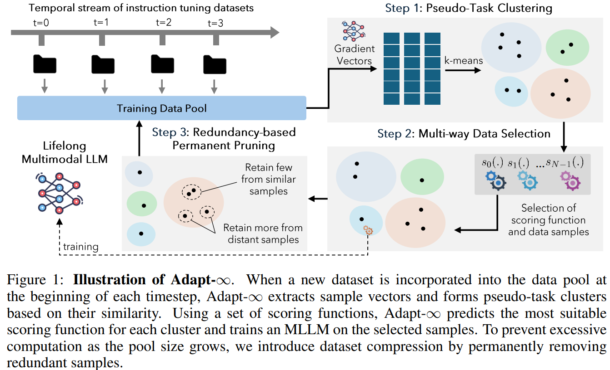

# ADAPT- $\infty$ : Scalable Lifelong Multimodal Instruction Tuning via Dynamic Data Selection
[](https://arxiv.org/abs/2410.10636)


### Authors: [Adyasha Maharana*](https://adymaharana.github.io/), [Jaehong Yoon*](https://jaehong31.github.io/), [Tianlong Chen](https://tianlong-chen.github.io/), [Mohit Bansal](https://www.cs.unc.edu/~mbansal/)
### University of North Carolina at Chapel Hill

<div align=center> 

</div>

### Install

Our codebase is derived from the [LLaVA](https://github.com/haotian-liu/LLaVA) repository. We follow their guidelines for setting up the environment.

1. Clone this repository and navigate to the folder
```
git clone https://github.com/adymaharana/adapt-inf.git
cd adapt-inf
```

2. Install Package
```
conda create -n llava python=3.10 -y
conda activate llava
pip install --upgrade pip  # enable PEP 660 support
pip install -e .
```

3. Install additional packages for training cases and evaluation
```
pip install -e ".[train]"
pip install flash-attn --no-build-isolation
pip install nltk
pip install google-generativeai
pip install datasets
```

### Datasets
Setup dataset (and image) directory paths in `config.py`.
Download the datasets used in our lifelong multimodal instruction tuning setup as follows:

1. LLaVA-665K Dataset
Follow the instructions [here](https://github.com/haotian-liu/LLaVA?tab=readme-ov-file#visual-instruction-tuning) to download the LLaVA training dataset. Remove samples for which images are not available.
```
python utils/download_datasets.py --dataset llava
```

2. M3IT Dataset
Download the dataset from HuggingFace.
```
python utils/download_datasets.py --dataset m3it
```

3. Download MiniGPT4 Stage 2 dataset from [here](https://github.com/Vision-CAIR/MiniGPT-4/blob/d94738a7626ec43eba6c2cddf3cd2043f1a9689a/dataset/README_2_STAGE.md?plain=1#L7).
Post-process the dataset for use with this codebase.
```
python utils/download_datasets.py --dataset minigpt4
```

2. MANTIS Dataset
Download the dataset from HuggingFace.
```
python utils/download_datasets.py --dataset mantis
```

### Selection and Training
Instructions coming soon! 


### Reference
Please cite our paper if you use the $D^2$ pruning method in your works:
```bibtex

@article{maharana2024adapt,
  title         = {ADAPT- $\infty$ : Scalable Lifelong Multimodal Instruction Tuning via Dynamic Data Selection},
  author        = {Adyasha Maharana and Jaehong Yoon and Tianlong Chen and Mohit Bansal},
  year          = {2024},
  archivePrefix = {arXiv},
  primaryClass  = {cs.LG},
  eprint        = {2410.10636}
}
```